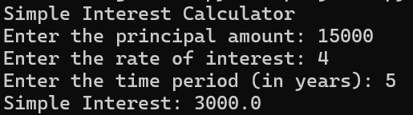

# AIM: Calculating Simple Interest
Write a Python program to calculate the simple interest based on user input. The
program should prompt the user to enter the principal
amount, the rate of interest, and the time period in years. It
should then compute the simple interest using the formula
Simple Interest=(Principal×Rate×Time) /100 and display the
result.

**Input:** 
```
Enter Principal Amount: 15000
Enter Rate of Interest: 10
Enter Time Period in Years: 5
```

**Expected Output:**
```
Simple Interest: 6000.0
```

**Sample Output:**


